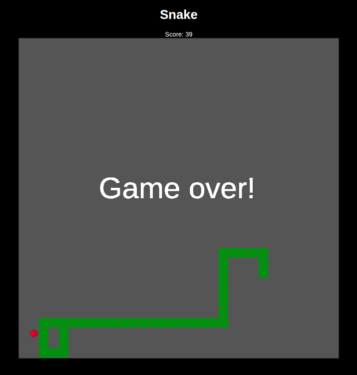

# Javascript Snake

De [instructie](_index.md).

## Licentie
Deze instructies worden, net als alle andere instructies van CoderDojo Nijmegen, aangeboden onder een [Creative Commons Attribution-NonCommercial-ShareAlike 4.0 International Licentie](http://creativecommons.org/licenses/by-nc-sa/4.0/).
