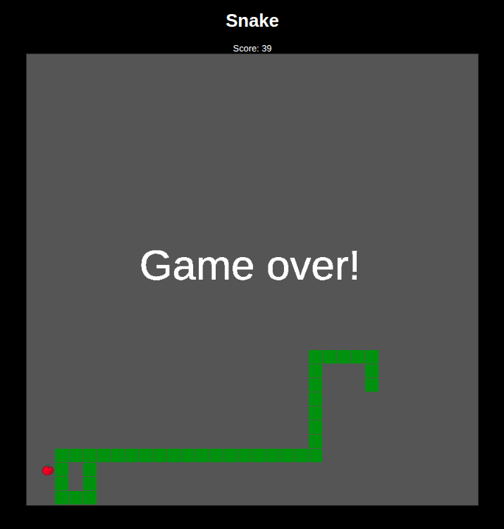

We gaan Snake bouwen voor in de browser.

<!--more-->

## Introductie


Snake is een mobiele video game [geïntroduceerd op een Nokia telefoon in 1998](https://en.wikipedia.org/wiki/Snake_(1998_video_game)).

### Spelregels
Het doel van het spel Snake is om zoveel mogelijk fruit te eten (dit is je score).
Hoe meer je eet, hoe langer de slang wordt en ook beweegt de slang sneller.
Als de slang tegen zichzelf botst of buiten het scherm gaat is het game over.

Dus om Snake te bouwen moet het spel het volgende doen:

- Beweeg de slang met de pijltjestoetsen
- Plaats op een willekeurige plek fruit
- De slang moet het fruit kunnen eten
  - Als er fruit gegeten is moet de slang langer worden
  - Als er fruit gegeten is krijg je een punt
- Als de slang tegen zichzelf botst, is het game over
- Ook als de slang buiten het scherm gaat is het game over

Nu we de spelregels duidelijk hebben en weten wat het spel moet gaan doen, is het tijd om Snake te gaan bouwen!

## Wat heb je nodig?

Een text editor als [Visual Studio Code](https://code.visualstudio.com/) en natuurlijk een browser zoals Chrome.

## Instructie

Dit gaan we maken:



### 1. HTML

We beginnen met de basis. Maak een nieuw bestand aan met bijvoorbeeld de naam `snake.html`. Kopieer en plak daarin
onderstaande code. Als je het bestand opent in Chrome, zie je een groot vierkant. Dit is het speelveld van de game.

```html
<!DOCTYPE html>
<html lang="en">
<head>
    <meta charset="UTF-8">
    <title>Snake</title>
    <style>
        canvas {
            display: block;
            margin: 0 auto;
            border: 1px solid black;
        }
        h1 {
            text-align: center;
        }
    </style>
</head>
<body>
<h1>Snake</h1>
<div class="snakearea">
    <canvas id="speelveld" width="800" height="800"></canvas>
</div>
</body>
</html>
```

### 2. Een appel

We gaan nu aan de slag met Javascript en beginnen met het tekenen van een appel:

Voeg toe op regel 17 in de vorige code:
```html
<script>
</script>
```
En tussen de `<script>` en `</script>` tags:

```javascript
    const speelveld = document.getElementById("speelveld");
    const ctx = speelveld.getContext("2d");

    const vakGrootte = 25;
    const appelGrootte = vakGrootte / 2 + 1;
    const aantalVakjes = speelveld.width / vakGrootte;

    const appel = { x: 0, y: 0 };

    function tekenAppel() {
        ctx.fillStyle = "red";
        ctx.beginPath();
        ctx.arc(appel.x * vakGrootte + appelGrootte, appel.y * vakGrootte + appelGrootte, appelGrootte, 0, 2 * Math.PI);
        ctx.fill();
    }

    tekenAppel();
```
Je ziet nu in de browser linksboven in het vierkant een rode cirkel: de appel.

We hebben best veel code nodig gehad, maar regels 1 t/m 8 zijn nodig ter voorbereiding van tekenen en de indeling van het vierkant
in kleine vakjes van 25 bij 25 pixels.

`function tekenAppel()` tekent tenslotte de rode cirkel.

### 3. De kop van de slang

Voeg toe na regel `const appel = { x: 0, y: 0 };`:

```javascript
    const slang = [{ x: 10, y: 10 }];
```

En dan vóór regel `tekenAppel();`:

```javascript
    function tekenSlang() {
        for (let slangDeel of slang) {
            ctx.fillStyle = "green";
            ctx.fillRect(slangDeel.x * vakGrootte, slangDeel.y * vakGrootte, vakGrootte - 1, vakGrootte - 1);
        }
    }
```
En na regel `tekenAppel();`:

```javascript
    tekenSlang();
```

Variabele `slang` is een lijst van delen van de slang. Deze lijst wordt steeds grotere naarmate de slang meer appels
heeft gegeven. Voor ieder slangdeel bepalen de x en y de positie van dat deel op het speelveld.   
Functie `tekenSlang` gaat langs ieder deel van de slang met een "for"-lus en tekent ieder deel op de juiste plaats
bepaald door `slangDeel.x` en `slangDeel.y`.


### 4. De slang besturen, deel 1

Om de slang te besturen, gaan we de pijltjestoetsen op je toetsenbord gebruiken.  
Als eerste stap gaan het indrukken van de pijltjestoetsen vertalen naar een richting voor de slang: omhoog, omlaag,
link, rechts.

We moeten eerst bewaren welke richting de slang op moet bewegen. We voegen daarvoor de volgende regel toe na de regel
met daarin `const slang = [{ x: 10, y: 10 }];`. We beginnen met de richting naar rechts:

```javascript
    let richting = "rechts";
```

En vervolgens voegen we code toe om het indrukken van de pijltjestoetsen om te zetten naar een richting:

```javascript
    document.addEventListener("keydown", (event) => {
        switch (event.key) {
            case "ArrowUp": richting = "omhoog"; break
            case "ArrowDown": richting = "omlaag"; break
            case "ArrowLeft": richting = "links"; break
            case "ArrowRight": richting = "rechts"; break
        }
        console.log(richting);
    });
```

Als je dit hebt toegevoegd, dan zie de kop van de slang nog niet bewegen. Maar je kunt wel de richting als tekst wel
zijn de "developer console". Om daar te komen druk je op toetscombinatie `ctrl + shift + i`. Je kunt dan zien wat er
aan de "achterkant" van de webpagina gebeurd. Kies tabje "console" en klik dan weer op de webpagina. Als je dan
op de pijltjestoetsen drukt, zie je richtingen getoond in die console.


### 4. De slang besturen, deel 2

We kunnen de slang alleen besturen als het ook beweegt. Dus we beginnen met het laten bewegen van de slang:

```javascript
    function verplaatsSlang() {
        const nieuweSlangenKop = {...slang[0]};
        switch (richting) {
            case "omhoog": nieuweSlangenKop.y -= 1; break;
            case "omlaag": nieuweSlangenKop.y += 1; break;
            case "links": nieuweSlangenKop.x -= 1; break;
            case "rechts": nieuweSlangenKop.x += 1; break;
        }
        slang.unshift(nieuweSlangenKop);
        slang.pop();
    }
```

Deze code maakt een nieuwe kop van de slang aan, voegt die toe aan de slang (`slang.unshift(nieuweSlangenKop)`) en verwijdert het
achterste deel van de slang (`slang.pop()`). Hiermee verplaatst de slang iedere keer 1 blokje verder.

Om de slang dus te laten bewegen, moeten we deze functie meerdere keren achter elkaar uitvoeren. Bij iedere keer dat
de functie wordt uitgevoerd, zal de slang weer een blokje verder verplaatsen.

Om deze functie en die om de slang en appel te tekenen meerdere keren uit te voeren, hebben we de volgende code nodig:

```javascript
    function gameLoop() {
        verplaatsSlang();
        tekenAppel();
        tekenSlang();
    }

    setInterval(gameLoop, 100);
```

`setInterval` roept functie `gameLoop` 10 x per seconde aan. Hiermee wordt dus 10 x per seconde de slang verplaatst en
de slang en appel opnieuw getekend.

Als je dit test, zie je de slang bewegen, maar het einde van de slang wordt steeds langer. Dat is gek, want we hebben
code toegevoegd om het einde van de slang weer te verwijderen, toch?  
Dit komt, doordat we het speelveld niet leeg maken voordat we de slang en de appel opnieuw tekenen. De vorige slang
blijft dus staan.

We maken een nieuwe functie `maakSpeelveldLeeg()` en voegen die toe aan functie `gameLoop()`:

```javascript

function maakSpeelveldLeeg() {
    ctx.clearRect(0, 0, speelveld.width, speelveld.height);
}

function gameLoop() {
    maakSpeelveldLeeg();
    verplaatsSlang();
    tekenAppel();
    tekenSlang();
}
```

We hebben nu al veel code geschreven. Als je niet zeker weet of je het allemaal goed hebt gedaan, kun je even in
dit bestand kijken: [tot-en-met-opdracht-4.html](tot-en-met-opdracht-4).

### 5. Appels eten

De slang eet appels als de kop van de slang een appel raakt. Dat zullen we dus moeten toevoegen aan onze code:

Vervang: 
```javascript
        slang.unshift(nieuweSlangenKop);
        slang.pop();
```

Met:
```javascript
        slang.unshift(nieuweSlangenKop);
        if (nieuweSlangenKop.x === appel.x && nieuweSlangenKop.y === appel.y) {
            nieuwePlaatsAppel();
        } else {
            slang.pop();
        }
```
Als de `nieuweSlangenKop` nu op dezelfde plek komt als de `appel`, wordt functie `nieuwePlaatsAppel()` aangeroepen.
Maar ook wordt `slang.pop()` niet aangeroepen en dus wordt de slang 1 blokje langer.

We moeten nog wel functie `nieuwePlaatsAppel()` maken:

```javascript
    function nieuwePlaatsAppel() {
        appel.x = Math.floor(Math.random() * aantalVakjes);
        appel.y = Math.floor(Math.random() * aantalVakjes);
    }
```

`Math.random()` is een functie in Javascript om zomaar een getal tussen 0 en 1 te maken. Iedere keer weer een ander 
getal. Door dit getal met het `aantalVakjes` op het speelveld te vermenigvuldigen en af te ronden (`Math.floor()`), 
kunnen we nieuwe `x` en `y` posities van de appel bepalen.

### 6. Game over: als de slang tegen zichzelf botst

De meeste van de spelregels hebben we nu gemaakt in het spel. Maar één van de regels is dat het spel over is als de
slang tegen zichzelf botst. Dus dat moeten we er nog even aan toe voegen.

Voeg aan het begin van de `gameLoop()` functie het volgende toe:

```javascript
    function gameLoop() {
        if (isGameOver()) {
            return;
        }
        maakSpeelveldLeeg();
```

Als `isGameOver()` waar is, dan eindigt `gameLoop()` en stop het spel.

Om dit te laten werken, moeten we functie `isGameOver()` maken:

```javascript
    function isGameOver() {
        return slangHeeftZichzelfGeraakt();
    }
```
Het spel is over als `slangHeeftZichzelfGeraakt()` waar is. Deze functie ziet er als volgt uit:

```javascript
    function slangHeeftZichzelfGeraakt() {
        const slangenKop = slang[0];
        for (let slangDeel of slang.slice(1)) {
            if (slangDeel.x === slangenKop.x && slangDeel.y === slangenKop.y) {
                return true;
            }
        }
        return false;
    }
```
In deze functie wordt de positie van de `slangenKop` vergeleken met alle `slangDeel`en na de kop. Als een deel wordt
gevonden op dezelfde positie, dan is het resultaat van `slangHeeftZichzelfGeraakt()` waar (`true`).  
Als er geen gevonden wordt, is het resultaat niet waar (`false`).

### 7. Game over: als de slang de randen heeft geraakt

We hebben de `gameOver()` functie al, maar moeten het aanpassen met de 2e voorwaarde:

```javascript
    function isGameOver() {
        return slangHeeftZichzelfGeraakt() || slangHeeftEenRandGeraakt();
    }
```
`||` betekend hier "of", dus als `slangHeeftZichzelfGeraakt()` of `slangHeeftEenRandGeraakt()` waar is, dan geeft 
`isGameOver()` ook waar (true) terug.

Met nieuwe functie `slangHeeftEenRandGeraakt()`:

```javascript
    function slangHeeftEenRandGeraakt() {
        const slangenKop = slang[0];
        return slangenKop.x < 0 || slangenKop.x >= aantalVakjes || slangenKop.y < 0 || slangenKop.y >= aantalVakjes;
    }
```

### 8. Game over: toon game over!

Als het game over is, stopt nu het spel. Maar verder zie je niet dat het spel afgelopen is. Het zou beter
zijn als we dat laten zien in het spel.  
Als `isGameOver()` waar is, roepen we `toonGameOver()` aan:

```javascript
    function gameLoop() {
        if (isGameOver()) {
            toonGameOver();
            return;
        }
        maakSpeelveldLeeg();
```

En voegen die toe aan het script:

```javascript
    function toonGameOver() {
        ctx.fillStyle = "orange";
        ctx.font = "75px Arial";
        ctx.fillText("Game over!", 200, 400);
    }
```


### 9. De score

We zouden het bijna vergeten, maar ook de score moet worden bijgehouden.

Voeg de volgende functie toe:

```javascript
    let score = 0;
    function toonScore() {
        ctx.fillStyle = "black";
        ctx.font = "30px Arial";
        ctx.fillText(`Score ${score}`, 350, 30);
    }
```

En roep deze functie aan, aan het einde van de `gameLoop()`:

```javascript
    function gameLoop() {
        if (isGameOver()) {
            toonGameOver();
            return;
        }
        maakSpeelveldLeeg();
        verplaatsSlang();
        tekenAppel();
        tekenSlang();
        toonScore();
    }
```
### 10. Een échte appel

Het rode cirkeltje wat de appel voorstelt, is een beetje saai. We kunnen het ook vervangen met een plaatje van een
appel.

We voegen allereerst een plaatje toe aan de html, regels 3, 4 en 5:

```html
<div class="snakearea">
    <canvas id="speelveld" width="800" height="800"></canvas>
    <div style="display: none;">
        
    </div>
</div>
```

En dan vervangen we de inhoud van functie `tekenAppel()` met:

```javascript
    const appelPlaatje = document.getElementById("appel");
    function tekenAppel() {
        ctx.drawImage(appelPlaatje, appel.x * vakGrootte, appel.y * vakGrootte, appelGrootte, appelGrootte);
    }
```

En we vervangen:

```javascript
    const appelGrootte = vakGrootte / 2 + 1;
```

Met:

```javascript
    const appelGrootte = vakGrootte * 1.2;
```

## Goed gedaan!
En dat is het, je hebt het spel Snake gebouwd! Hoe lang hou jij het vol en wat is de hoogste score die je kunt krijgen?

Heb je iets niet goed begrepen, vraag het dan aan één van de mentoren, we helpen je natuurlijk graag!

Je kunt ook altijd een kijkje nemen bij de andere kinderen, misschien kan jij hun helpen!

Hier kun je tenslotte nog het eindresultaat zien: [resultaat](/instructies/javascript-snake/eind-instructie).



