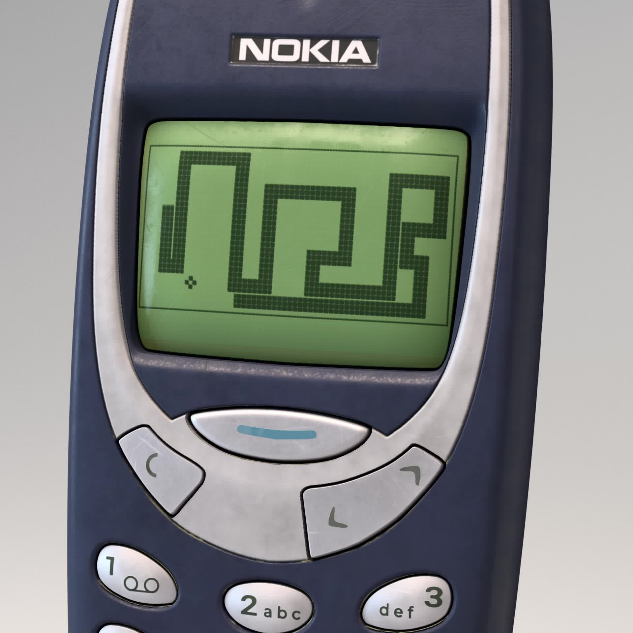

We gaan Snake bouwen voor in de browser.

<!--more-->

## Introductie



Snake is een mobiele video game [geïntroduceerd op een Nokia telefoon in 1998](https://en.wikipedia.org/wiki/Snake_(1998_video_game)).

### Spelregels
Het doel van het spel Snake is om zoveel mogelijk fruit te eten (dit is je score).
Hoe meer je eet, hoe langer de slang wordt en ook beweegt de slang sneller.
Als de slang tegen zichzelf botst of buiten het scherm gaat is het game over.

Dus om Snake te bouwen moet het spel het volgende doen:

- Beweeg de slang met de pijltjestoetsen
- Plaats op een willekeurige plek fruit
- De slang moet het fruit kunnen eten
  - Als er fruit gegeten is moet de slang sneller bewegen
  - Als er fruit gegeten is moet de slang langer worden
  - Als er fruit gegeten is krijg je een punt
- Als de slang tegen zichzelf botst, is het game over
- Ook als de slang buiten het scherm gaat is het game over

Nu we de spelregels duidelijk hebben en weten wat het spel moet gaan doen, is het tijd om Snake te gaan bouwen!

## Wat heb je nodig?

Een text editor als [Visual Studio Code](https://code.visualstudio.com/) en natuurlijk een browser zoals Chrome.

## Instructie

### 1. HTML

We beginnen met de basis. Maak een nieuw bestand aan met bijvoorbeeld de naam `snake.html`. Kopieer en plak daarin
onderstaande code. Als je het bestand opent in Chrome, zie je een groot vierkant.

```html
<!DOCTYPE html>
<html lang="en">
<head>
    <meta charset="UTF-8">
    <title>Snake</title>
    <style>
        canvas {
            display: block;
            margin: 0 auto;
            border: 1px solid black;
        }
    </style>
</head>
<body>
<div class="snakearea">
    <canvas id="playground" width="800" height="800"></canvas>
</div>
</body>
</html>
```

### 2. Een appel

We gaan nu aan de slag met Javascript en beginnen met het tekenen van een appel:

Voeg toe op regel 17 in de vorige code:
```html
<script>
</script>
```
En tussen de `<script>` en `</script>` tags:

```javascript
    const elemPlayground = document.getElementById("playground");
    const ctx = elemPlayground.getContext("2d");

    const vakGrootte = 25;
    const appelGrootte = vakGrootte / 2 + 1;
    const aantalVakjes = elemPlayground.width / vakGrootte;

    const appel = { x: 0, y: 0 };

    function tekenAppel() {
        ctx.fillStyle = "red";
        ctx.beginPath();
        ctx.arc(appel.x * vakGrootte + appelGrootte, appel.y * vakGrootte + appelGrootte, appelGrootte, 0, 2 * Math.PI);
        ctx.fill();
    }

    tekenAppel();
```
Je ziet nu linksboven in het vierkant een rode cirkel: de appel.

We hebben best veel code nodig gehad, maar regels 1 t/m 8 zijn nodig ter voorbereiding van tekenen en de indeling van het vierkant
in kleine vakjes van 25 bij 25 pixels.

`function tekenAppel()` tekent tenslotte de rode cirkel.

### 3. De kop van de slang

Voeg toe na regel `const appel = { x: 0, y: 0 };`:

```javascript
    const slang = [{ x: 10, y: 10 }];
```

En dan voor regel `tekenAppel();`:

```javascript

    function tekenSlang() {
        slang.forEach(slangDeel => {
            ctx.fillStyle = "green";
            ctx.fillRect(slangDeel.x * vakGrootte, slangDeel.y * vakGrootte, vakGrootte - 1, vakGrootte - 1);
        });
    }

```
En na regel `tekenAppel();`:

```javascript
    tekenSlang();
```

